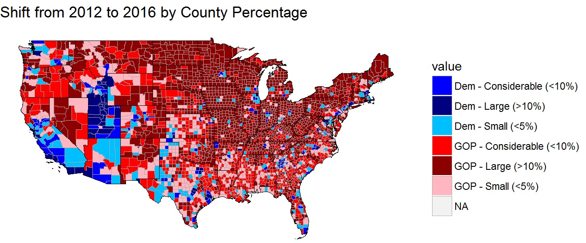
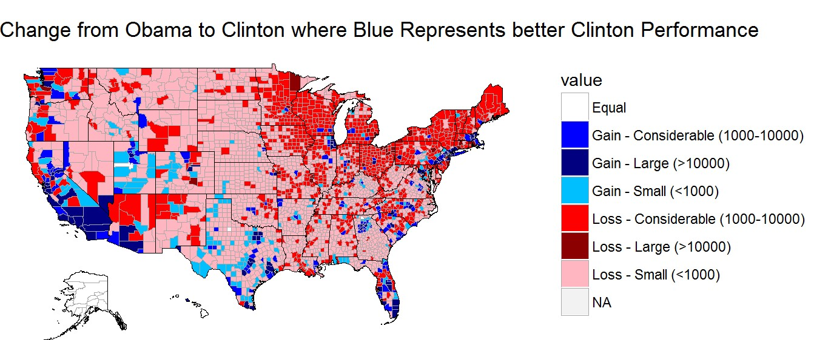
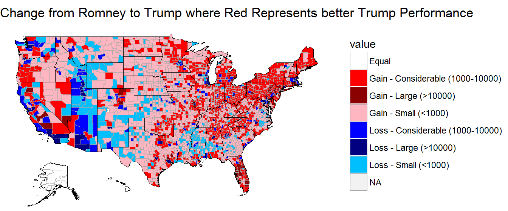
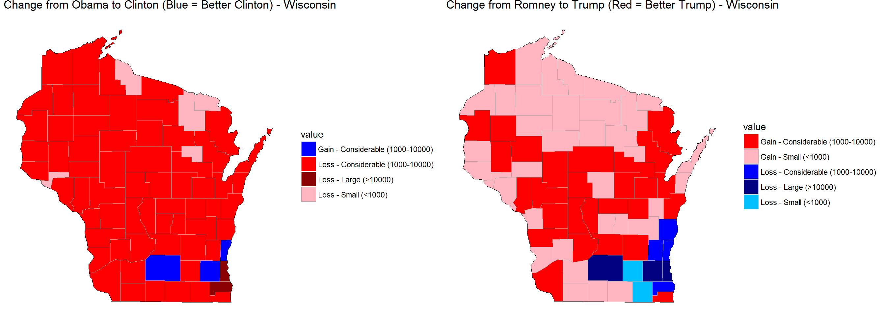
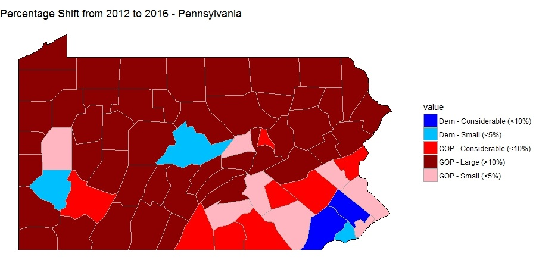
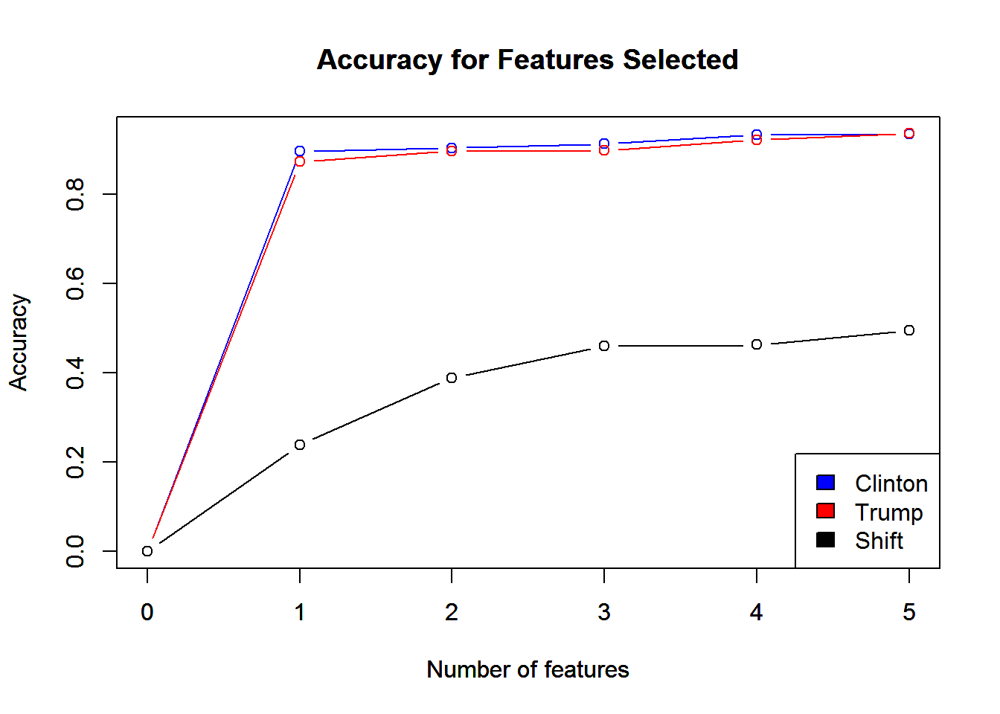
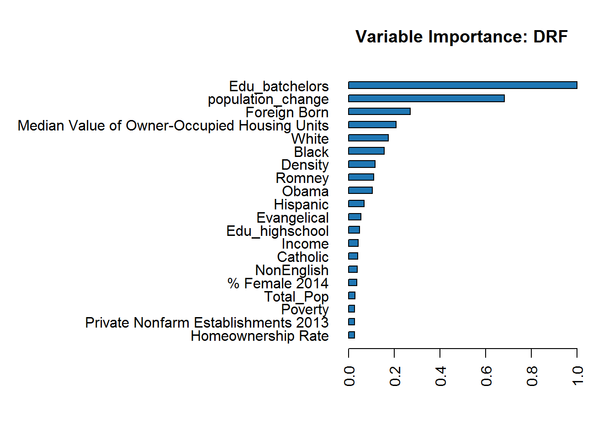
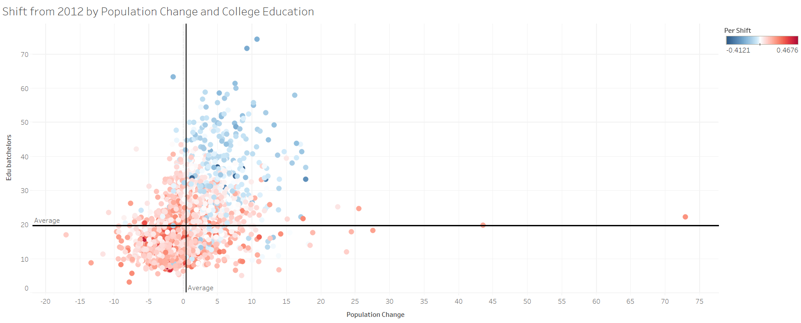

# Analyzing the 2016 Election
### A Tale of Two Nations

 

A follow-up analysis for additional topics such as third party votes and political polarization can be found [here](https://scottonestak.github.io/Projects/2016_Election/2016_Election_Analysis_Further.html).

All the code and work for this project can be found [here](https://github.com/ScottOnestak/Data-Analysis-Projects/tree/master/2016-Election-Analysis).

 

On November 8, 2016, Americans headed to the polls to elect the next President of the United States. To anyone paying any attention to the election, almost every media outlet, polling organization, and predictive modeling forecast read the same – that Hillary Clinton would easily defeat Donald Trump and become the 45th President of the United States. FiveThirtyEight predicted there was a 72% chance Clinton would win. The New York Times 85%, and the Huffington Post gave an astounding 98% likelihood that Clinton would win. However, it is now 2017, and Donald Trump is the President of the United States of America. What was it that everyone seemed to miss that led voters to elect Donald Trump?

 

## The Gains and the Losses

 

To understand how well Mrs. Clinton and Mr. Trump performed, its best to start by comparing them to their predecessors – Barack Obama and Mitt Romney.

Hillary Clinton was able to make inroad in certain regions of the country comparative to Barack Obama's 2012 performance. To her demise, however, these gains came mainly in states where it didn’t matter electorally. Clinton was able to rake up huge numbers of votes comparative to Barack Obama in blue states such as California and Massachusetts. Additionally, Clinton's gains in deep red states such as Texas, Arizona, and Utah amounted to relatively nothing as Trump was able to easily carry these states.

These gains came at a cost though. Clinton majorly underperformed Barack Obama in the Midwest and much of the Northeast. These included swing states such as Iowa, Wisconsin, Ohio, Michigan, Pennsylvania, New Hampshire, and Maine. All except New Hampshire and Maine (excluding it's 2nd Congressional District) would swing from the Democrats to the Republicans.

On the other hand, Trump incurred some sizeable vote losses from Mitt Romney's 2012 performance, but mostly all of his losses occurred in inconsequential states. Due to third party candidate, Evan McMullin, Trump saw a large drop off in votes from Mormons in Utah and Idaho. Utah, the reddest state in the nation, and Idaho were still easily carried by Trump. At the same time, Trump's losses in counties through states like Arizona, California, New Mexico, Mississippi, and Alabama, and Massachusetts once again had no effect on his Electoral College performance.

Now, pairing these effects together, we can examine the total percentage shift at the county level from the 2012 election results to 2016. One of the most staggering statistics is that the vast majority of counties in the Midwest and Northeast shifted more than 10% to Donald Trump from the 2012 election results.

However, what was the driving force behind these shifting voter preferences?

 

## A Tale of Two Swing States

 

The United States has always been a nation of diverse ideas, cultures, religions, and so much more. Therefore, it should come as no surprise that voters do not behave homogenously across all states. The perfect example of this are two swing states that both went for Donald Trump – Wisconsin and Pennsylvania.

In Wisconsin, Donald Trump made only relatively small to considerable sized gains compared to Mitt Romney. In a state Barack Obama won by about 7%, it'd be impossible for Trump to win this state on his performance alone. However, Clinton lost voters at an unprecedented rate in Wisconsin compared to her overall performance. She lost over 1,000 votes in almost every county in the state, losing over 10,000 votes in the county where Milwaukeeans reside. This allowed Trump to win the state by less than a percentage point.

In Pennsylvania, the Republicans increased their total number of votes in all but three counties, and in the three where Republicans didn’t gain votes, the Democrats did. However, Trump was able to pull off a win in the Keystone State by less than a percentage point by running the tally up in rural areas. Trump basically shifted every rural county to him by more than 10 percentage points relative to 2012. At the same time, he piled on massive positive shifts from Erie and Scranton, as well as a small shift from Philadelphia, to squeak out the win in a typically blue state. Clinton was able to make minute gains in Pittsburgh and relatively strong gains in some Philadelphia suburbs, but this would not be enough for her to retain a state everyone believed would be hers.

 

## But Why Did People Vote the Way They Voted?

Using many county-level features, such as income, population change, and other demographical information, models could be constructed for Clinton's and Trump's performances at the county level, as well as the percentage change from the 2012 election.

To no surprise, the most important feature in determining Clinton’s performance was Obama's performance and Trump's performance was Romney's performance. While Obama’s performance could explain about 90% of Clinton's performance, Romney's performance could only explain about 87% of Trump’s performance. This suggests to me that Hillary Clinton’s base looked more like Obama's than Trump's base looked like Romney's. Thinking about this logically, it makes sense. There was relatively little pushback against Hillary Clinton's nomination; whereas Trump faced backlash from #NeverTrump-ers and Mormons out in Utah and Idaho while also likely bringing in some first-time voters. At the same time, it should be noted that both bases look quite similar to 2012, suggesting that the shifts at the margin are what determine the overall election outcome.

At first, there appeared very little predictive power in modeling the percentage shift from 2012 to 2016. Using the same modeling as the former Clinton and Trump models, the top five features were only able to explain about 50% of voter shift at the county level. However, America is a vastly diverse nation. Should we expect percentage level shifts in LA, the smallest Texas county, and Orlando, Florida, to all move together at the same magnitude? No, because Americans who think differently probably vote differently.

Therefore, I separated the swing states from the red and blue states to model the percentage shift at the county level. Now, the top five features accounted for about 70% of the voter shift at the county level and two variables stood out from the rest – the percentage of individuals with a bachelor's degree and the population change.

The percentage of individuals with a bachelor's degree was highly correlated with both Clinton and Trump. Clinton had a highly positive correlation, meaning as the percent of individuals with a bachelor's degree grew in a county, she would be expected to get more votes. Trump's correlation was almost equal in the opposite direction. Therefore, as the percentage increased, Trump's vote percentage in that county would decrease.

The same was true for population change - to a lesser extent. Population change wasn't as highly correlated with the candidates, but the overall trends were the same. Even further, population change and the percentage of people with a bachelor's degree were highly correlated as well.

 

## But What Does This All Mean?

 

I believe the population change variable is measuring two very important factors about the well-being of the county's residents. If a county's population is decreasing, it means that either the elderly are dying off while the younger generation are not having children, people are moving away, or there’s a mix of both.

In the first scenario, this does not bode well for the economic future of a county. In the second, the economy must be bad enough that people are willingly moving away. I suspect it's mostly the later scenario at play, but both scenarios send a signal of troubling economic conditions.

Understanding this puts the election in a new perspective. It seems to me that the 2016 election could be summarized as the haves vs the have-nots. Clinton's voters were more likely to be educated, city dwellers, who were experiencing prosperous economic futures. Trump's voters were more likely to be less educated, rural folks, who were experiencing dire economic realities now and in the future.

Plotting the counties based on these two features, you could practically draw a diagonal line separating the counties that went for Trump and the counties that went for Clinton. To be grossly generalistic, Hillary Clinton's husband's 1992 campaign perfectly captured the essence of the 2016 election: "the economy, stupid."

 

