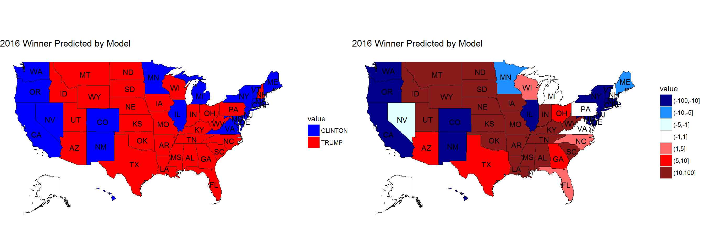

# A Further Analysis of the 2016 Election
### Going more in depth to explain, explore, and justify the models and their outcomes

 

This is a follow-up to my original analysis of the 2016 election, which can be found [here](https://scottonestak.github.io/Projects/2016_Election/2016_Election_Analysis.html).

All the code and work for this project can be found [here](https://github.com/ScottOnestak/Data-Analysis-Projects/tree/master/2016-Election-Analysis).

 

On November 8, 2016, Americans headed to the polls to elect the next President of the United States. To anyone paying any attention to the election, almost every media outlet, polling organization, and predictive modeling forecast read the same – that Hillary Clinton would easily defeat Donald Trump and become the 45th President of the United States. FiveThirtyEight predicted there was a 72% chance Clinton would win. The New York Times 85%, and the Huffington Post gave an astounding 98% likelihood that Clinton would win. However, it is now 2017, and Donald Trump is the President of the United States of America. What was it that everyone seemed to miss that led voters to elect Donald Trump?

 

## Political Polarization

There is no doubt that America has become more polarized since the 2012 election. Rural districts clearly swung very hard to the right - with most swinging by more than 10%. At the same time, many urban counties swung equally as hard in the opposite direction.

Examining the density plots for the margin by which the winner won the county for 2012 and 2016, American counties appear to have experienced greater political polarization. In 2012, 22% of counties had a margin of less than 20%. After the 2016 election, less than 14% of counties were decided by a margin of less than 20%. Weighting each county by the number of total votes cast, the average American lived in a county where the presidential candidate winner won by about 24%. In 2016, this increased by over 3.5% to almost 28%.

This increased polarization may work well for both the Democrat and Republican Parties, but it calls into question the changing structure of the American electorate. By being able to easily define their electorates, Republicans and Democrats increase their abilities to hold onto House and Senate seats as well as more efficiently run get-out-the-vote efforts. However, should society be concerned about the increased partisanship at the local level? If we are only surrounded by those with which we agree, does this lead us further from being able to hold constructive dialog, debate, and understand others’ differing perspectives?

In short, America over the long-term has always been brought back to "the middle." If there is no longer those around you with differing viewpoints, does this effectively lead to further ideological drifting to the extremes? And can the people who supposedly belonged to "the middle" still maintain their political ideologies years, decades, and centuries from now or will "the middle" cease to exist for America in the future? If it cannot, what effect will this have over the direction of our county in the long-term?

 

## The Third-Party Vote

 

Faced with historically low approval ratings for both presidential candidates, it was believed third party candidates, such as Gary Johnson, Evan McMullin, and Jill Stein, may have been able to gain some traction in the general election. While over 5% of the American electorate voted for third party candidates, one specific candidate was not able to catch on nationally.

Evan McMullin successfully captured over 20% of the vote in Utah and a significant chunk in Idaho due to his support among Mormons. Gary Johnson, former governor of New Mexico, was able to capture about 9% of the vote from his home state, and Bernie Sanders received about 5% of the write-in vote in Vermont.

One trend that appears when mapped nationally is that the Midwest and West were more responsive to third party candidates that the Northeast and South. One explanation for that may be that most of the swing states Hillary Clinton and Donald Trump were courting were up and down the East Coast. However, why would states that were unimportant electorally, such as Mississippi and Alabama, vote so little for third party candidates while a swing state like Nevada was more accepting of third party candidates? This may lead once again to the idea that there are diverse ways people think and act across the nation. Therefore, it is possible it may be more of a regional phenomenon - though we cannot be sure.

 

## Predicting Votes for Trump and Clinton

 

To predict the votes for the two presidential candidates, four models were constructed. The first two attempt to predict the percentage the candidate will receive in each county. The second two attempt to predict the total number of votes a candidate will receive in each county. The Clinton percentage and total vote models, as well as the Trump percentage and total vote models, should produce very similar results when the total number of votes is provided as a variable for the total vote models.

The reason there are two models for each candidate is so that we can better examine the residuals. The models predicting percentage at the county level produce residual plots to examine patterns in the residuals while the total vote models are used to predict the winner of each state.

To construct these models, a linear stepwise function using bidirectional elimination was deployed on the variable set. The model is then optimized by minimizing the AIC. While there is very likely to be interaction between variables, I believe a linear model was appropriate because political parties attempt to segment people into groups, which can be seen through the increased polarization in America. The most obvious examples being white voters, women, men, high- and low-income earners, etc.

Examining the residuals for Hillary Clinton, a picture emerges to show that the residuals are not randomly distributed across the nation. As could be expected, Mrs. Clinton overperformed in Arkansas, where she was previously the first lady. Additionally, she overperformed in many western states such as California, Arizona, and Washington. Her underperformance in New Mexico can most likely be attributed to Gary Johnson voters. However, she underperforms in large sections of the country - mainly throughout the Midwest. Clinton underperformed in states like Colorado, Minnesota, Iowa, Missouri, and areas throughout Ohio, Pennsylvania, and New York.

While many of these states proved to be not extremely consequential electorally, her underperformance in certain regions did potentially have negative effects on the Democratic Party. One example of this is Missouri. While the presidential race wasn’t that close, the Senate race in that state was. As a result of Clinton’s underperformance, it may have cost them a Missouri Senate seat last election cycle.

For Donald Trump, his residuals look very familiar to Hillary Clinton’s but in the opposite direction. He experienced extremely negative residuals in Utah due to third party candidate Evan McMullin - even after controlling for the Mormon population. In addition, Trump overperformed in southern Georgia and almost every county in eastern Ohio. Trump underperformed in states like Kansas, Oklahoma, and Arkansas. However, this would be nowhere near enough to cost him those states.

An important thing to remember is that large groupings of residuals suggest some variable or effect that the model was unable to explain. As a result, we can see that even after including many important variables in the model, it can be difficult to explain why people vote the way they vote.

One reason may be that local issues influenced the national race. Another is that the American electorate could look very different each election cycle. A country like Australia may experience less unexplained deviation because voting is mandatory for every citizen. However, America does not force citizens to vote. As people tend to vote for their interests, some may be motivated to vote for some candidates in some years while not voting in others. At the same time, due to polarization, people with the same interests probably tend to live near each other, which could explain regional deviations. However, this is just a possibility that needs further examination.

Using the total votes model for each county. These could be aggregated to form a total vote prediction for Donald Trump and Hillary Clinton within each state. Even after accounting for all the variables, this model was still unable to correctly predict the winner for the two closest states in the election - Michigan and New Hampshire. (Alaska was excluded because county level data was still unavailable at the time the dataset was created.) While it could correctly predict Michigan and New Hampshire would be within 1%, this shows how close presidential elections can become. Even with all this data after the fact, I can still not explain why those two states voted the way they did. As can be imagined, this must be exponentially harder for campaigns, polling firms, model developers, and political commenters to understand before any votes have been cast.

 

## Predicting the Swing

 

While each election can be examined within its own world, like the previous analysis, another way to think about an election is to use the previous election as a base for the parties and then try to explain away why people move to and from the parties from one election cycle to the next. In trying to predict the swing at the county level, I do just that.

The swing variable is calculated by taking Trump's effective margin over Clinton and subtracting Romney's margin over Obama from the 2012 election cycle. A positive swing shows that Trump performed better in the county compared to Clinton that Romney did compared to Obama. A negative swing shows Clinton performed better in the county compared to Trump than Obama did compared to Romney.

Originally, I had tried to determine the most important variables for the swing variable using data from the entire United States (excluding Alaska because their data wasn’t available yet). Then, using the top five variables, I constructed linear models to determine how much of the variation could be explained away. Unfortunately, only about 50% could be explained using these top five variables.

However, America is a diverse nation with diverse ideas and opinions. Why should Los Angeles, California; Erie, Pennsylvania; and small-town Texas all swing with the same magnitude for the most important variables? Therefore, I broke out the swing states from the solid red and blue states to examine the swing.

Now, the top features were able to explain about 70% of total variation and the top two variables - the percentage of individuals with a bachelor's degree and the population change - stood out from the rest of the variables.

The percentage of individuals with a bachelor's degree was highly correlated with both Clinton and Trump. Clinton had a highly positive correlation, meaning as the percent of individuals with a bachelor's degree grew in a county, she would be expected to get more votes. Trump's correlation was almost equal in the opposite direction. Therefore, as the percentage increased, Trump's vote percentage in that county would decrease.

The same was true for population change - to a lesser extent. Population change wasn't as highly correlated with the candidates, but the overall trends were the same. Even further, population change and the percentage of people with a bachelor's degree were highly correlated as well.

I believe the population change variable is measuring two very important factors about the well-being of the county's residents. If a county's population is decreasing, it means that either the elderly are dying off while the younger generation are not having children, people are moving away, or there’s a mix of both.

This makes logical sense to me based on the voters Trump and Hillary alienated from their bases that were part of Romney's and Obama's bases. Most of the #NeverTrump-ers tended to be highly-educated life-long Republican voters. Additionally, Hillary Clinton appeared to alienate a large chunk of white working-class voters.

Plotting these two features, the counties that migrated towards Trump and towards Clinton appear to separate from each other in the graph. It wouldn't be hard to imagine constructing an SVM for the counties that went toward Trump and counties that went towards Clinton based on this graph, suggesting to me that these two features were the most dominant ones in shifting voters in the 2012 to 2016 elections.

One of the questions that remains is whether those voters switched parties, voted for a third-party candidate, or refused to vote at all. Without polling these individuals specifically, it is very hard to determine. My hunch would lead me to believe most #NeverTrump-ers did not vote for Hillary Clinton because many appeared to be life-long Republican voters. Clinton's loss in votes throughout Wisconsin would suggest her white, working class voters stayed home, but the increased Republican vote share would suggest the white, working class switched parties. This is a barrier that the data cannot evaluate but an important determinant for the political parties going forward - especially for the Democratic Party since they did not emerge victorious.

 

